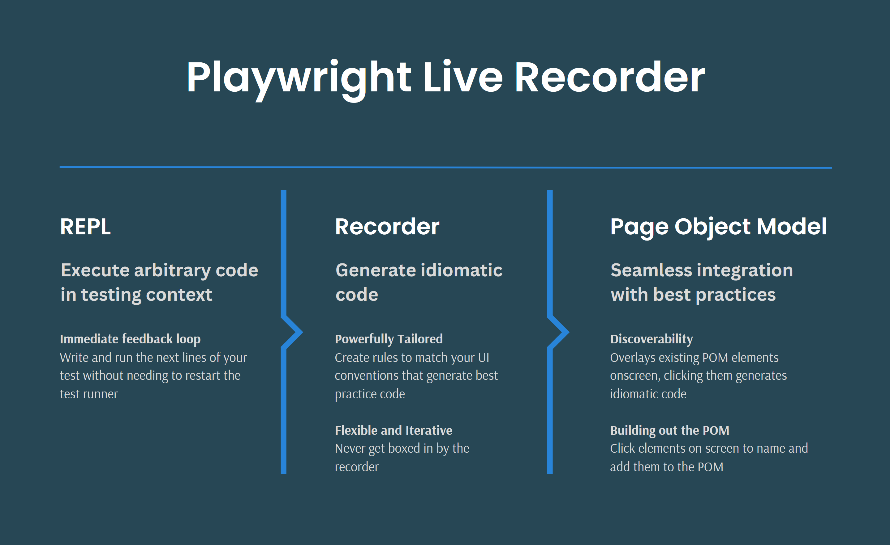
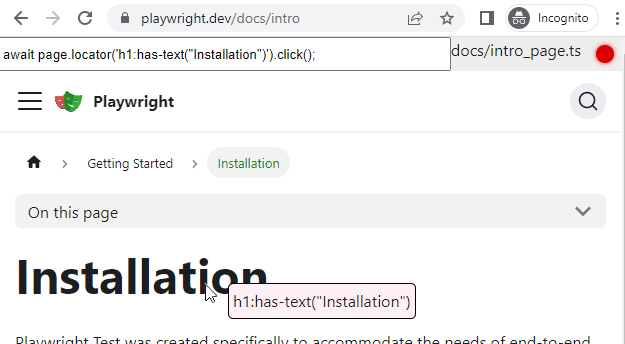
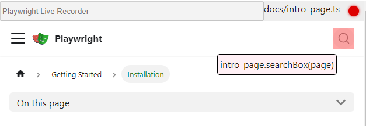

# playwright-live-recorder

## 🛑 Warning: this library is incomplete, and in active development 🛑
Use at your discretion. This library is already very useful, but is certainly also riddled with bugs.


# Features

>### **REPL** - Execute arbitrary code in testing context
>**Immediate Feedback Loop**  
>Adds live coding in testing context from browser console when running tests. Provides programmatically configurable recorder.
>
----
>### **Recorder** - Generate idiomatic code
>**Powerfully Tailored**  
>Create rules to match your UI conventions and generate best practice code
>
>**Flexible and Iterative**  
>Never get boxed in by the recorder
----
>### **Page Object Model** - Seamless integration with best practices
>**Discoverability**  
>Overlays existing POM elements onscreen, clicking them generates idiomatic code
>
>**Building out the POM**  
>Click elements on screen to name and add them to the POM 🛑 (not yet implemented)
>
>**Hierarchies and components**  
>Support for nested page object model and component objects ⚠️ (partially implemented)


# Installation  
using yarn
```bash
yarn add -D @dnvgl/playwright-live-recorder
```
or npm
```Shell
npm install -D @dnvgl/playwright-live-recorder
```
additional requirements: @playwright/test  
`todo: figure out appropriate dev/peer/direct dependency on @playwright/test`

# Usage (Test Code)

In a playwrite test, add this line at the end of the playwright test you want to continue recording
``` ts
await PlaywrightLiveRecorder.start(page, s => eval(s));
//recorded lines will be inserted here
```

Run the test in headed mode

> 💡 use vscode plugin `ms-playwright.playwright` and right click the `play`  icon in the margin, click `Debug test` to run headed mode quickly for a single test

> 💡 create a shortcut key of CTRL+ALT+SHIFT+R for command `Test: Debug Test at Cursor`


Test will run, when `PlaywrightLiveRecorder.start` line is executed lib functionality will be exposed to the browser and all scripts will be loaded in the browser. Test execution waits until browser is closed.  
Newly recorded test lines are inserted into test file.

# Usage (Browser)

## **Record and REPL**
Playwright live recorder adds a control bar to the top of the browser page.
>   
> In the top right corner is `Record` ⚪/🔴 record can be toggled off/on by clicking the icon, or pressing CTRL+ALT+SHIFT+R  
>> 💡 if the recorder blocks your testing session, work past it by toggling record off, clicking, then toggling it back on

> When record is toggled on a hover tooltip is positioned next to the cursor showing the selector that will be used.  
> Clicking will generate code using the `RecorderRules`, execute it, and insert it into your test file.  
>   
> The generated code is displayed in the Text Input in the top left of the control bar.  
> This code may be modified, press &lt;Enter&gt; to re-execute and modify in place in your test  
>> 💡 if the generated code fails to execute it will be inserted into your test file commented out.  
>> you may keep updating and re-evaluating until it succeeds, or comment it out yourself and add whatever comment you want on the end

> 💡 Playwright Live Recorder comes out-of-the-box with a small set of recorder rules (conventions). These are completely configurable/overridable. See [src/browser/PW_live_recorderRules.js](src/browser/PW_live_recorderRules.js) for the default set. RecorderRules file path may be overridden by setting `PlaywrightLiveRecorder.config.recorder.path = 'your/new/recorderRules.js'`

> ### 🔍🔄
> to aid in live development, recorderRules file is watched and immediately reloaded in browser when changes are saved

## **Page Object Model**
The label to the left of the 🔴 record button shows the page object model path+filename

If this file exists in your test project Playwright Live Recorder will attempt to load and transpile into the browser session.

Page model objects are reflected across looking for the convention
``` ts
static propertyName_selector = 'selector text here';
static propertyName(page: Page) { return page.locator(this.propertyName_selector); }
```
the *_selector pieces are used to highlight elements in the page. When clicked it will call the associated pom function in your test code

adding this code to the page object model file  

``` ts
//docs/intro_page.ts
import { Page } from "@playwright/test";

export class intro_page {
    static searchBox_selector = '[aria-label="Search"]';
    static searchBox(page: Page) { return page.locator(this.searchBox_selector); }
}
```
Results in this page object model selector overlay.  
Clicking it will generate the code it shows.
>   

> ### 🔍🔄
> to aid in live development, page object model files are watched and immediately reloaded in browser when changes are saved


> ### ⚠️ this is a work in progress  
> not yet implemented:
> * nested page object models (partially implemented)
> * recorder authors new page object model files
> * recorder adds to existing page object model files
> * tricks to execute newly authored code in testing context


## **Troubleshooting**
> vscode
> * run test with debug and set breakpoints in @dnvgl/playwright-live-recorder source
> * watch the `Debug Console` output

> browser
> * open dev tools, use console, most variables/functions are prefixed with `PW_`
> * sources - files are prefixed with `PW_`
>   * add breakpoints to see what's going on/wrong
> * don't be afraid to use the console to try evaluating things and poke around

# Other Notes

This project is in it's infancy, but already looks very promising.  
I'm sure you're able to break it, I'm more interested in how far we can get by trying to work _with_ it.  

🛠️ This project has a glaring lack of expertise in a number of areas, assistance (especially in live typescript transpilation) is greatly appreciated!
