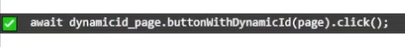

### v2.0.57
* updated readme, recorded demo video

### v2.0.56
* cli command fix

### v2.0.53
* Display currently executing lines of code in repl on-screen
* fix many issues after page navigation (tool only worked for SPAs previously)
* changed (broken) postinstall to cli command `npx @dnvgl/playwright-live-recorder`

### v2.0.52
* UI rework
* Now aware of Page Object Model helper methods

### v2.0.48
* Live code execution method much simplified and much more robust (todo: write tech doc about this)
* bugfix: Make page object model tools build correct paths on non-windows filesystems

----


# Getting Started

## Watch the video demonstration

[](https://youtu.be/ys5vczHm9sw)


-----
## Prerequisites

`@playwright/test` (typescript)

start with a repo with @playwright/test set up, if starting with a new repo see https://playwright.dev/docs/intro  

## Install

``` bash
npm install -D @dnvgl/playwright-live-recorder
#or
yarn add -D @dnvgl/playwright-live-recorder
#or
pnpm add -D @dnvgl/playwright-live-recorder
```

run the setup script
``` bash
npx @dnvgl/playwright-live-recorder
```

Ensure baseURL is set to the root url of your webapp in `playwright.config.ts` e.g.
``` ts
//playwright.config.ts
export default defineConfig({
  //...
  use: {
    baseURL: 'https://demo.playwright.dev/todomvc/#/',
    //...
```

# How to use
## Typescript Code for test

In a playwright test, add the import
``` ts
import { PlaywrightLiveRecorder } from '@dnvgl/playwright-live-recorder';
```

and then add this await line at the end of the playwright test you want to record into
``` ts
// note - recorded lines will be inserted here
await PlaywrightLiveRecorder.start(page, s => <undefined>eval(s));
```

Run the test in headed mode

> 💡 if you're using the vscode plugin `ms-playwright.playwright` it will automatically run in headed mode with PWDEBUG set to console (see modifications to `.vscode/settings.json`)  
> 💡 if you're running from the command line, set the environment variable `PWDEBUG=console` before running the playwright command, e.g. `playwright test --ui`

Test will run, when `PlaywrightLiveRecorder.start` line is executed lib functionality will be exposed to the browser and all scripts will be loaded in the browser. Test execution waits until browser is closed.  
Newly recorded test lines are inserted into test file.  
Newly added page object model files will be created, newly added items are inserted into the page object model files.  
Newly added or modified test lines above `PlaywrightLiveRecorder.start` are executed upon file save.

## Browser

>   
> Playwright live recorder adds a control bar to the top of the browser page.  
> * Record mode ⚪/🔴 can be toggled off/on by clicking the icon, or pressing CTRL+ALT+SHIFT+R  
> * The label is the page object model path+filename  
> * the f(x) button displays public helper functions available from your page object model file, click the green ➕ to add an example to the file
>
> When record is toggled on a hover tooltip is positioned next to the cursor showing the code that will be generated  
>> 💡 if the recorder blocks your testing session, work past it by toggling record off, clicking, then toggling it back on

## **Recording**
> With record toggled on, click an element to add it to your test
> * If the element is not part of the Page Object Model, you will be prompted to give it a name
>   * Press enter and the new property will be added to the page object model file, and the element will highlight (default: salmon color), to indicate it's a part of the page object model
>   * Press [esc] to skip adding to the page object model
> * If the element is part of the Page Object Model, it will already be highlighted salmon color
>   * Clicking it will add a call to the page object model method to your test  
>
> After clicking an element, the test code will be added and saved to your test file. File changes are automatically re-executed.  
> You can always modify the text code and save to re-execute changed lines.  
>> 💡 This is useful to change a `.click()` call to a `.fill()`, or to wrap an `expect` around the element you just clicked.  Save the file and it's re-executed.
>> Another powerful workflow is to edit the page object model function, save the file, and then add the same line again to the test file to force a re-execute
>> You can keep iterating this way until the function implementation is correct.  
>
> 💡 whenever code lines are executed in the test they'll display overlayed on-screen
>   
</details>
