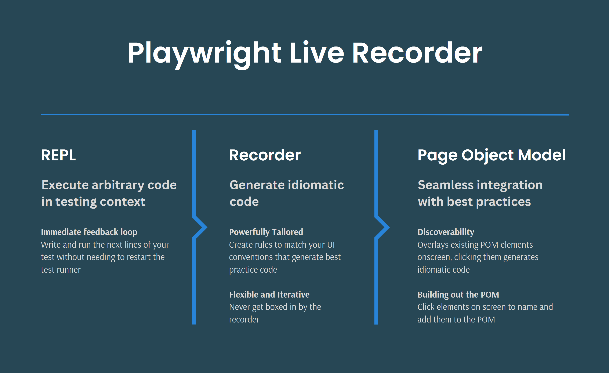

# playwright-live-recorder

## Warning: this library is incomplete, and in active development
Use at your discretion. This library is already extremely powerful, but is certainly also riddled with bugs.

>## **REPL** - Execute arbitrary code in testing context
>**Immediate Feedback Loop**  
>Adds live coding in testing context from browser console when running tests. Provides programmatically configurable recorder.
>
----
>## **Recorder** - Generate idiomatic code
>**Powerfully Tailored**  
>Create rules to match your UI conventions and generate best practice code
>
>**Flexible and Iterative**  
>Never get boxed in by the recorder
----
>## **Page Object Model** - Seamless integration with best practices
>**Discoverability**  
>Overlays existing POM elements onscreen, clicking them generates idiomatic code
>
>**Building out the POM**  
>Click elements on screen to name and add them to the POM 🛑 (not yet implemented)
>
>**Hierarchies and components**  
>Support for nested page object model and component objects ⚠️ (partially implemented)

# Additional Details

## Usage

todo: add usage examples and gifs

## Features

todo: add features list

## Technical Implementation

todo: add diagram