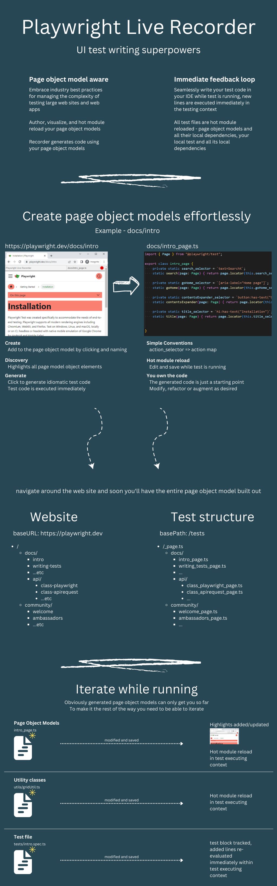
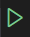
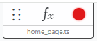

### 🛑 Note: this library is incomplete, and in active development 🛑
Use at your discretion. This library is already very useful, but is certainly also riddled with bugs.

----





# Getting Started

## Watch the video


[](https://youtu.be/73SnYrsrrTo)


-----
## Details
-----

## Prerequisites

`@playwright/test` (typescript)

start with a repo with @playwright/test set up, if starting with a new repo see https://playwright.dev/docs/intro  

## Install

via yarn
``` bash
yarn add -D @dnvgl/playwright-live-recorder
```
or npm
``` bash
npm install -D @dnvgl/playwright-live-recorder
```

Expose playwright's selectors for use within this library:
> if using vscode  
> create the file `.vscode/settings.json`
``` json
//.vscode/settings.json
{
    "playwright.env": {
        "PWDEBUG": "console"
      },
}
```
> otherwise, set PWDEBUG=console in your shell before executing the test in headed mode

Set the baseURL in `playwright.config.ts` to the root url of your webapp, e.g.
``` ts
//playwright.config.ts
export default defineConfig({
  //...
  use: {
    baseURL: 'https://demo.playwright.dev/todomvc/#/',
    //...
```

# How to use
## Typescript Code for test

In a playwright test, add the import
``` ts
import { PlaywrightLiveRecorder } from '@dnvgl/playwright-live-recorder';
```

and then add this line at the end of the playwright test you want to record into
``` ts
// recorded lines will be inserted here
await PlaywrightLiveRecorder.start(page, s => eval(s));
```

Run the test in headed mode

> 💡 use vscode plugin `ms-playwright.playwright` and right click the play icon  in the margin, click `Debug test` to run headed mode quickly for a single test

> 💡 create a shortcut key of CTRL+ALT+SHIFT+R for command `Test: Debug Test at Cursor`


Test will run, when `PlaywrightLiveRecorder.start` line is executed lib functionality will be exposed to the browser and all scripts will be loaded in the browser. Test execution waits until browser is closed.  
Newly recorded test lines are inserted into test file.

## Browser

> Playwright live recorder adds a control bar to the top of the browser page.
>   
> * Record mode ⚪/🔴 can be toggled off/on by clicking the icon, or pressing CTRL+ALT+SHIFT+R  
> * The label on the right is the page object model path+filename  
> * The first box allows executing code directly within the test context  
>
> When record is toggled on a hover tooltip is positioned next to the cursor showing the code that will be generated 
>> 💡 if the recorder blocks your testing session, work past it by toggling record off, clicking, then toggling it back on

## **Recording**
> With record toggled on, click an element to add it to your test
> * If the element is not part of the Page Object Model, you will be prompted to give it a name
>   * Press enter and the new property will be added to the page object model file, and the element will highlight (default: salmon color), to indicate it's a part of the page object model
>   * Press [esc] to skip adding to the page object model, and the code will be added directly to your test
> * If the element is part of the Page Object Model, it will already be highlighted salmon color
>   * Clicking it will add a call to the page object model method to your test

> After clicking an element, the test code will be executed and added to your test file  
> The [Playwright Live Recorder] input box will be filled with the last executed line of code  
> Modify the code and press enter modify and re-run the last line of the test
>> 💡 This is useful to change a `.click()` call to a `.fill()`, or to wrap an `expect` around the element you just clicked.  
>> Another powerful workflow is to edit the page object model function, save the file, and re-execute the last line by pressing &lt;enter&gt; in the input box.  
>> You can keep iterating this way until the function implementation is correct.
</details>
